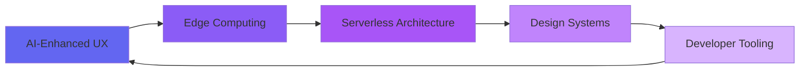

<div align="center">

<!-- Dynamic Header with Fallback -->
<picture>
  <source media="(prefers-color-scheme: light)" srcset="assets/name-banner-light.svg" />
  <source media="(prefers-color-scheme: dark)" srcset="assets/name-banner.svg" />
  
</picture>

<!-- Animated Typing Effect -->
<a href="https://mernfy.vercel.app/">
  
</a>

### Crafting scalable, human-centered products with modern JavaScript, cloud-native architecture, and thoughtful design

<br />

<!-- Professional Social Links -->
<p align="center">
  <a href="https://mernfy.vercel.app/">
    
  </a>
  <a href="https://linkedin.com/in/iamashishrathaur/">
    
  </a>
  <a href="https://stackoverflow.com/users/23966934/">
    
  </a>
  <a href="mailto:ashishrathour.dev@gmail.com">
    
  </a>
  <a href="https://cal.com/haxcod/discovery">
    
  </a>
</p>

<!-- Navigation -->
<p align="center">
  <a href="#-about-me">About</a> •
  <a href="#-tech-stack">Tech Stack</a> •
  <a href="#-featured-projects">Projects</a> •
  <a href="#-github-insights">Insights</a> •
  <a href="#-achievements">Achievements</a> •
  <a href="#-connect">Connect</a>
</p>


</div>

## 🎯 About Me

```typescript
const ashish = {
  role: "Full-stack Engineer",
  focus: ["Design Systems", "Developer Experience", "Product Engineering"],
  currentlyBuilding: "Next-gen web experiences with AI-enhanced UX",
  philosophy: "Code is poetry, design is empathy, shipping is everything",
  
  workStyle: {
    approach: "Design-first, performance-obsessed, user-centered",
    methodology: ["Agile", "Design Thinking", "Continuous Iteration"],
    collaboration: "Open communication, remote-first, async-friendly"
  },
  
  beyondCode: ["Technical Writing", "Mentorship", "Public Speaking"],
  funFact: "I debug with console.log() and I'm not ashamed 🐛"
};
```

<details>
<summary>📈 <b>What Drives Me</b></summary>
<br/>

- **Building with Purpose**: Every line of code should solve a real problem and enhance user experience
- **Design Excellence**: Beautiful, accessible interfaces aren't optional—they're essential
- **Knowledge Sharing**: Growing by teaching others and contributing to the community
- **Continuous Learning**: Staying ahead of the curve in an ever-evolving tech landscape
- **Product Mindset**: Owning the full cycle from ideation to delivery and iteration

</details>


## 🛠️ Tech Stack

<div align="center">

### Frontend Development


### Backend Development


### Database & Cloud


### DevOps & Tools


### Design & Prototyping


</div>


## 🚀 Featured Projects

<div align="center">

<table>
  <tr>
    <td width="50%">
      <h3 align="center">MERNfy Portfolio</h3>
      <div align="center">
        <a href="https://mernfy.vercel.app/" target="_blank">
          
        </a>
        <p>
          <strong>A design-engineering lab</strong> showcasing immersive UX, product case studies, and interactive experiences built with Next.js and cutting-edge web technologies.
        </p>
        <p>
          <code>Next.js</code> <code>Tailwind CSS</code> <code>Framer Motion</code> <code>TypeScript</code>
        </p>
      </div>
    </td>
    <td width="50%">
      <h3 align="center">Open Source Contributions</h3>
      <div align="center">
        <a href="https://github.com/haxcod" target="_blank">
          
        </a>
        <p>
          <strong>Community-driven development</strong> contributing to popular packages, triaging issues, and documenting best practices for improved DevEx.
        </p>
        <p>
          <code>TypeScript</code> <code>React</code> <code>Node.js</code> <code>Documentation</code>
        </p>
      </div>
    </td>
  </tr>
</table>

### 🎯 Current Focus



</div>


## 📊 GitHub Insights

<div align="center">

<!-- Primary Stats with Multiple Fallbacks -->
<a href="https://github.com/haxcod">
  <picture>
    <source media="(prefers-color-scheme: dark)" srcset="https://github-readme-stats.vercel.app/api?username=haxcod&show_icons=true&theme=tokyonight&hide_border=true&include_all_commits=true&count_private=true&cache_seconds=1800" />
    <source media="(prefers-color-scheme: light)" srcset="https://github-readme-stats.vercel.app/api?username=haxcod&show_icons=true&theme=default&hide_border=true&include_all_commits=true&count_private=true&cache_seconds=1800" />
    
  </picture>
</a>

<!-- Streak Stats with Multiple Fallbacks -->
<a href="https://github.com/haxcod">
  <picture>
    <source media="(prefers-color-scheme: dark)" srcset="https://streak-stats.demolab.com?user=haxcod&theme=tokyonight&hide_border=true&date_format=M%20j%5B%2C%20Y%5D&cache_seconds=1800" />
    <source media="(prefers-color-scheme: light)" srcset="https://streak-stats.demolab.com?user=haxcod&theme=default&hide_border=true&date_format=M%20j%5B%2C%20Y%5D&cache_seconds=1800" />
    
  </picture>
</a>

<!-- Fallback: Static Streak Badge (if images fail) -->
<noscript>
  
</noscript>

</div>

<div align="center">

<!-- Language Stats with Fallback -->
<a href="https://github.com/haxcod">
  <picture>
    <source media="(prefers-color-scheme: dark)" srcset="https://github-readme-stats.vercel.app/api/top-langs/?username=haxcod&theme=tokyonight&hide_border=true&layout=compact&langs_count=8&cache_seconds=1800" />
    <source media="(prefers-color-scheme: light)" srcset="https://github-readme-stats.vercel.app/api/top-langs/?username=haxcod&theme=default&hide_border=true&layout=compact&langs_count=8&cache_seconds=1800" />
    
  </picture>
</a>

</div>

<div align="center">

<!-- Trophy Stats with Fallback -->
<a href="https://github.com/haxcod">
  <picture>
    <source media="(prefers-color-scheme: dark)" srcset="https://github-profile-trophy.vercel.app/?username=haxcod&theme=tokyonight&no-frame=true&column=7&margin-w=15&margin-h=15&cache_seconds=1800" />
    <source media="(prefers-color-scheme: light)" srcset="https://github-profile-trophy.vercel.app/?username=haxcod&theme=flat&no-frame=true&column=7&margin-w=15&margin-h=15&cache_seconds=1800" />
    
  </picture>
</a>

</div>

<details>
<summary>📈 <b>Detailed Contribution Analytics</b></summary>
<br/>

<div align="center">

<!-- Activity Graph -->
<picture>
  <source media="(prefers-color-scheme: dark)" srcset="https://github-readme-activity-graph.vercel.app/graph?username=haxcod&theme=tokyo-night&hide_border=true&area=true&cache_seconds=1800" />
  <source media="(prefers-color-scheme: light)" srcset="https://github-readme-activity-graph.vercel.app/graph?username=haxcod&theme=github-light&hide_border=true&area=true&cache_seconds=1800" />
  
</picture>

<br/><br/>

<!-- Profile Summary Cards -->
<picture>
  <source media="(prefers-color-scheme: dark)" srcset="https://github-profile-summary-cards.vercel.app/api/cards/profile-details?username=haxcod&theme=tokyonight&cache_seconds=1800" />
  <source media="(prefers-color-scheme: light)" srcset="https://github-profile-summary-cards.vercel.app/api/cards/profile-details?username=haxcod&theme=default&cache_seconds=1800" />
  
</picture>

<br/>

<picture>
  <source media="(prefers-color-scheme: dark)" srcset="https://github-profile-summary-cards.vercel.app/api/cards/repos-per-language?username=haxcod&theme=tokyonight&cache_seconds=1800" />
  <source media="(prefers-color-scheme: light)" srcset="https://github-profile-summary-cards.vercel.app/api/cards/repos-per-language?username=haxcod&theme=default&cache_seconds=1800" />
  
</picture>

<picture>
  <source media="(prefers-color-scheme: dark)" srcset="https://github-profile-summary-cards.vercel.app/api/cards/most-commit-language?username=haxcod&theme=tokyonight&cache_seconds=1800" />
  <source media="(prefers-color-scheme: light)" srcset="https://github-profile-summary-cards.vercel.app/api/cards/most-commit-language?username=haxcod&theme=default&cache_seconds=1800" />
  
</picture>

</div>

</details>

<div align="center">

<!-- Snake Animation -->
<picture>
  <source media="(prefers-color-scheme: dark)" srcset="https://raw.githubusercontent.com/haxcod/haxcod/output/github-snake-dark.svg" />
  <source media="(prefers-color-scheme: light)" srcset="https://raw.githubusercontent.com/haxcod/haxcod/output/github-snake.svg" />
  
</picture>

</div>


## 🏆 Achievements

<div align="center">

### Professional Certifications & Recognitions

[](https://unacademy.com/)
[](https://google.com/search?q=Anditita+Make+My+Home)
[](https://stackoverflow.com/users/23966934/)

### Impact Metrics

<table>
  <tr>
    <td align="center" width="25%">
      <b>🌟 Open Source</b><br/>
      <sub>Active Contributor</sub>
    </td>
    <td align="center" width="25%">
      <b>👥 Mentorship</b><br/> 
      <sub>Community Leader</sub>
    </td>
    <td align="center" width="25%">
      <b>📝 Technical Writing</b><br/>
      <sub>Knowledge Sharing</sub>
    </td>
    <td align="center" width="25%">
      <b>🎤 Public Speaking</b><br/>
      <sub>Tech Evangelist</sub>
    </td>
  </tr>
</table>

</div>


## 🌱 Current Learning Journey

<div align="center">

```diff
+ 🤖 AI-Enhanced User Interfaces & LLM Integration
+ ⚡ Edge Computing & Serverless Architecture
+ 📊 Advanced Observability & Performance Monitoring
+ 🎨 Advanced Design Systems & Component Libraries
+ 🔐 Web3 & Blockchain Fundamentals
```

</div>


## 💬 Let's Connect

<div align="center">

### Open for Collaboration

I'm always interested in:
- 🚀 **Product Development**: Building meaningful solutions that scale
- 🎯 **Consulting**: Architecture, performance, and DevEx optimization
- 🎤 **Speaking Engagements**: Sharing knowledge at conferences and meetups
- 🤝 **Mentorship**: Guiding aspiring developers and designers
- 💡 **Open Source**: Contributing to impactful community projects

<br/>

### Get in Touch

<p align="center">
  <a href="https://cal.com/haxcod/discovery">
    
  </a>
  <a href="https://linkedin.com/in/iamashishrathour/">
    
  </a>
  <a href="mailto:ashishrathour.dev@gmail.com">
    
  </a>
</p>

<br/>

### Support My Work

If you find my projects helpful, consider supporting:

<a href="https://www.buymeacoffee.com/haxcod">
  
</a>
<a href="https://github.com/sponsors/haxcod">
  
</a>

</div>


<div align="center">

### 📈 Profile Analytics


<br/>

---

<sub>⚡ This README is powered by passion, coffee, and endless curiosity</sub>

<sub>💡 **Last Updated**: Auto-generated with GitHub Actions</sub>

<sub>🔧 **Note**: If stats don't load, try refreshing the page or check back later - external APIs may occasionally experience downtime</sub>

</div>
