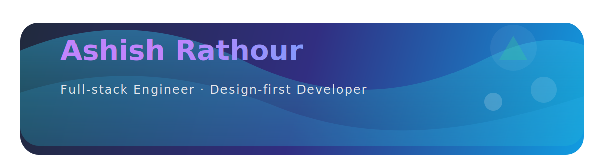

<picture>
  <source media="(prefers-color-scheme: light)" srcset="assets/name-banner-light.svg" />
  <source media="(prefers-color-scheme: dark)" srcset="assets/name-banner.svg" />
  
</picture>

**Designing reliable, human-centered products with modern JavaScript, cloud-native patterns, and a sprinkle of storytelling.**

 

  
  
  
  
  
  
  

## 🧭 Snapshot

- **Code meets craft**: I blend UX thinking with scalable engineering, crafting performant full-stack experiences.
- **Product mindset**: Comfortable owning the loop from ideation → delivery → iteration, using data to steer decisions.
- **Community-first**: Speaking, mentoring, and documenting learnings to lift the next wave of makers.

## 🛠️ Core Toolbox

| Frontend | Backend & APIs | Cloud & Ops |
| --- | --- | --- |
|    |    |    |
|   |    |    |

## 🚀 Currently Shipping

- **Next-gen web experiences** focused on accessibility, motion design, and performance budgets.
- **Composable backends** powered by TypeScript, serverless, and clean API contracts.
- **DX experiments**: building internal tooling and CLIs to shorten feedback loops for teams.

## 📰 Latest Dispatches

Curated stories, notes, and deep dives that keep the craft evolving.

<!-- latest-posts:start -->
<!-- Autogenerated by workflow: latest-posts.yml -->
<!-- Do not edit directly. Update `data/latest-posts.md` instead. -->
<!-- > 📝 [Designing with Purpose: Building Accessible UI Systems](https://example.com/blog/designing-with-purpose)
>
> Reimagining accessibility as a first-class design principle across modern product teams.

> ⚙️ [Scaling Next.js Apps with Edge Functions](https://example.com/blog/scaling-nextjs-edge)
>
> Field notes on latency budgets, streaming strategies, and observability at the edge.

> 🔁 [Developer Experience Diaries: Automating Every Feedback Loop](https://example.com/blog/dx-diaries)
>
> Lessons learned while crafting pipelines, bots, and dashboards that keep teams shipping. -->
<!-- latest-posts:end -->

## 📊 Impact Snapshot

  
  

  

  

  

  
  

  

## 🗂️ Featured Highlights

| Initiative | Snapshot | Stack |
| --- | --- | --- |
| [MERNfy](https://mernfy.vercel.app/) | Personal design-engineering lab showcasing immersive UX and product case studies. | Next.js · Tailwind CSS · Motion Design |
| Open-source contributions | Helping shape community packages, triaging issues, and documenting DevEx wins. | TypeScript · React · GitHub Actions |
| Mentorship & knowledge sharing | Hosting live sessions and guides focused on modern JavaScript and career growth. | Content strategy · Storytelling |

> Explore more in the pinned repositories and check-ins below — I love chatting about emerging tech, design systems, and developer tooling.

## 🧠 Learning Playlist

- **AI-assisted UIs**: weaving LLM features into day-to-day products with safety-first guardrails.
- **Edge-native deployments**: experimenting with Vercel/Netlify edge functions and serverless data.
- **Observability**: deep-diving into telemetry, structured logging, and performance archeology.

## 🛡️ Certifications & Recognitions

## 🤝 Let's Collaborate

- **Collab-ready**: Available for product experiments, consulting, and speaking engagements.
- **Mentorship**: Always happy to hop on a call with budding engineers and designers.
- **Say hi**: Reach me via the quick actions below.

## 🐍 Contribution Playground

  
  
  

