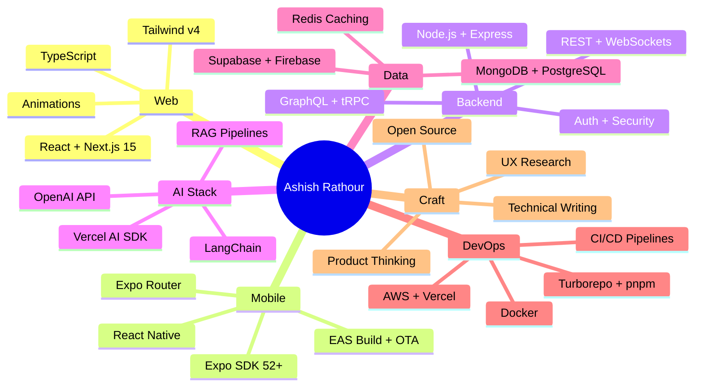
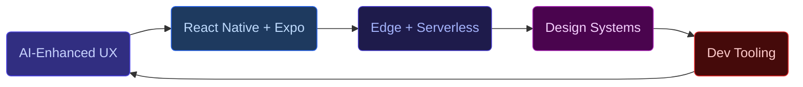
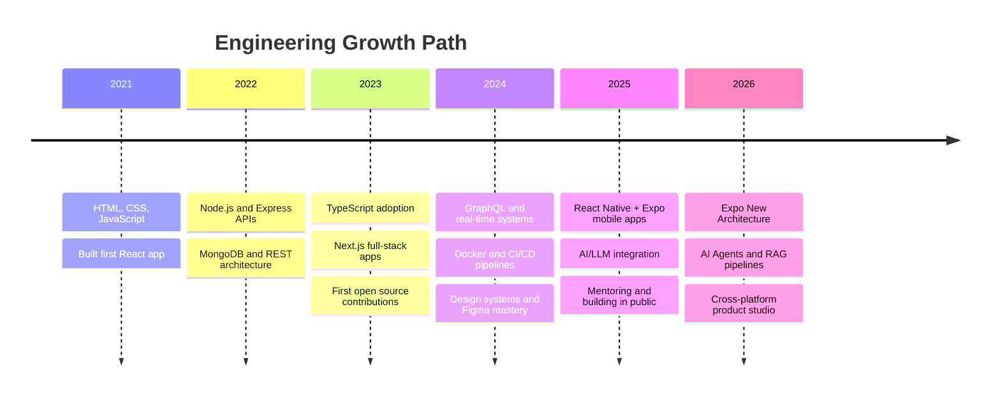

<div align="center">


<br/>


<br/><br/>

<p>
  
  &nbsp;
  
  &nbsp;
  
</p>

<p>
  <a href="https://mernfy.vercel.app/" target="_blank">
    
  </a>
  <a href="https://linkedin.com/in/iamashishrathaur/" target="_blank">
    
  </a>
  <a href="https://stackoverflow.com/users/23966934/" target="_blank">
    
  </a>
  <a href="mailto:ashishrathour.dev@gmail.com">
    
  </a>
  <a href="https://cal.com/haxcod/discovery" target="_blank">
    
  </a>
</p>

<p>
  <a href="#-who-am-i">Who Am I</a> &nbsp;·&nbsp;
  <a href="#%EF%B8%8F-tech-arsenal">Tech Arsenal</a> &nbsp;·&nbsp;
  <a href="#-featured-work">Featured Work</a> &nbsp;·&nbsp;
  <a href="#-github-stats">GitHub Stats</a> &nbsp;·&nbsp;
  <a href="#-achievements">Achievements</a> &nbsp;·&nbsp;
  <a href="#-currently-learning--2026">Learning</a> &nbsp;·&nbsp;
  <a href="#-lets-connect">Connect</a>
</p>

</div>


## 🧠 Who Am I


```ts
const ashish: Developer = {
  pronouns : "he/him",
  role     : "Full-Stack & Mobile Engineer",
  location : "India 🇮🇳",
  year     : 2026,

  focus: [
    "Design Systems",
    "Developer Experience",
    "AI-Enhanced Interfaces",
    "Cross-Platform Mobile (React Native + Expo)",
    "Product Engineering",
  ],

  currentlyBuilding: "AI-powered cross-platform apps with Expo SDK 52+",

  stack: {
    web      : ["React", "Next.js 15", "TypeScript", "Tailwind v4"],
    mobile   : ["React Native", "Expo", "EAS Build", "Expo Router"],
    backend  : ["Node.js", "Express", "GraphQL", "tRPC"],
    database : ["MongoDB", "PostgreSQL", "Redis", "Supabase"],
    ai       : ["OpenAI API", "LangChain", "Vercel AI SDK"],
    devops   : ["Docker", "AWS", "GitHub Actions", "Vercel"],
  },

  philosophy: [
    "Code is poetry — write it with intent",
    "Design is empathy — build with users in mind",
    "Shipping is everything — perfect is the enemy of done",
  ],

  funFact: "I debug with console.log() 🐛 and I am not ashamed",
};
```

<br clear="right"/>

> *"I don't just write code — I craft digital products that solve real problems at the intersection of engineering excellence and human-centered design."*

| 🎯 Building with Purpose | 🎨 Design Excellence | 📱 Mobile-First | 🚀 Product Mindset |
|:---:|:---:|:---:|:---:|
| Every line of code should solve a real problem | Beautiful, accessible interfaces are essential | Native-feel apps with React Native & Expo | Full cycle: ideation → build → ship → iterate |


## ⚔️ Tech Arsenal

<div align="center">

### 🖥️ Web Frontend


### 📱 Mobile — React Native & Expo


### ⚙️ Backend & APIs


### 🤖 AI & LLM Stack — 2026


### 🗄️ Database & Cloud


### 🛠️ DevOps & Tooling


### 🎨 Design & Prototyping


</div>

<br/>

### 🗺️ Engineering Mindmap — 2026


```mermaid
mindmap
  root((Ashish Rathour))
    Web
      React + Next.js 15
      TypeScript
      Tailwind v4
      Animations
    Mobile
      React Native
      Expo SDK 52+
      Expo Router
      EAS Build + OTA
    Backend
      Node.js + Express
      GraphQL + tRPC
      REST + WebSockets
      Auth + Security
    AI Stack
      OpenAI API
      LangChain
      Vercel AI SDK
      RAG Pipelines
    Data
      MongoDB + PostgreSQL
      Redis Caching
      Supabase + Firebase
    DevOps
      Docker
      AWS + Vercel
      Turborepo + pnpm
      CI/CD Pipelines
    Craft
      Product Thinking
      UX Research
      Technical Writing
      Open Source
```


## 🚀 Featured Work

<table>
  <tr>
    <td width="50%" valign="top">
      <h3>🌐 MERNfy — Design & Engineering Lab</h3>
      <p>A <strong>cutting-edge portfolio platform</strong> blurring the line between product and portfolio. Immersive UX, animated case studies, and interactive demos.</p>
      <p>
        
        
        
        
      </p>
      <a href="https://mernfy.vercel.app/"></a>
      <a href="https://github.com/haxcod"></a>
      <ul>
        <li>⚡ Lighthouse 98/100 Performance</li>
        <li>🎨 Custom design system, 40+ components</li>
        <li>📱 Mobile-first, fully responsive</li>
      </ul>
    </td>
    <td width="50%" valign="top">
      <h3>📱 Mobile Apps — React Native + Expo</h3>
      <p>Cross-platform <strong>mobile applications</strong> with Expo Router for file-based navigation and EAS for CI/CD builds and OTA updates.</p>
      <p>
        
        
        
        
      </p>
      <a href="https://github.com/haxcod"></a>
      <ul>
        <li>📲 Android & iOS from one codebase</li>
        <li>🔄 OTA updates via EAS Update</li>
        <li>🎞️ Smooth animations with Reanimated 3</li>
      </ul>
    </td>
  </tr>
  <tr>
    <td width="50%" valign="top">
      <h3>🤖 AI-Powered Apps — 2026</h3>
      <p>Building <strong>AI-enhanced web and mobile experiences</strong> using Vercel AI SDK, OpenAI APIs, and RAG pipelines for intelligent, context-aware products.</p>
      <p>
        
        
        
      </p>
      <a href="https://github.com/haxcod"></a>
    </td>
    <td width="50%" valign="top">
      <h3>📦 Open Source Contributions</h3>
      <p>Actively <strong>contributing to the ecosystem</strong> — triaging issues, merging PRs, writing documentation, and building community tools to improve DevEx.</p>
      <p>
        
        
        
      </p>
      <a href="https://github.com/haxcod"></a>
    </td>
  </tr>
</table>

<br/>

### 🔄 Current Focus Cycle


```mermaid
flowchart LR
    A("AI-Enhanced UX") --> B("React Native + Expo")
    B --> C("Edge + Serverless")
    C --> D("Design Systems")
    D --> E("Dev Tooling")
    E --> A

    style A fill:#312e81,color:#c7d2fe,stroke:#4f46e5
    style B fill:#1e3a5f,color:#bfdbfe,stroke:#2563eb
    style C fill:#1e1b4b,color:#a5b4fc,stroke:#4338ca
    style D fill:#4a044e,color:#f5d0fe,stroke:#a21caf
    style E fill:#450a0a,color:#fecaca,stroke:#dc2626
```


## 📊 GitHub Stats

<div align="center">


<br/><br/>


<br/><br/>


</div>

<details>
<summary><b>📈 Detailed Contribution Analytics</b></summary>
<br/>

<div align="center">


<br/>


<br/>


<br/>


</div>

</details>

<br/>

<div align="center">

<picture>
  <source media="(prefers-color-scheme: dark)" srcset="https://raw.githubusercontent.com/haxcod/haxcod/output/github-snake-dark.svg" />
  <source media="(prefers-color-scheme: light)" srcset="https://raw.githubusercontent.com/haxcod/haxcod/output/github-snake.svg" />
  
</picture>

</div>


## 🏆 Achievements & Impact

<div align="center">

<table>
  <tr>
    <td align="center">
      <br/>
      <sub>Educating the next generation of developers</sub>
    </td>
    <td align="center">
      <br/>
      <sub>Make My Home — Real-world product launch</sub>
    </td>
    <td align="center">
      <br/>
      <sub>Helping developers solve hard problems</sub>
    </td>
  </tr>
</table>

<br/>

<table>
  <tr>
    <td align="center" width="25%">
      <h2>🌟</h2>
      <b>Open Source</b><br/>
      <sub>Active Contributor</sub><br/>
      <sub>PRs · Issues · Docs</sub>
    </td>
    <td align="center" width="25%">
      <h2>👥</h2>
      <b>Mentorship</b><br/>
      <sub>Community Leader</sub><br/>
      <sub>Unacademy Mentor</sub>
    </td>
    <td align="center" width="25%">
      <h2>✍️</h2>
      <b>Technical Writing</b><br/>
      <sub>Knowledge Sharing</sub><br/>
      <sub>Guides · Tutorials</sub>
    </td>
    <td align="center" width="25%">
      <h2>🎤</h2>
      <b>Public Speaking</b><br/>
      <sub>Tech Evangelist</sub><br/>
      <sub>Talks · Workshops</sub>
    </td>
  </tr>
</table>

</div>


## 📡 Currently Learning — 2026

<div align="center">

```diff
@@  ── GROWTH ROADMAP 2026 ──  @@

+ AI Agents & RAG Pipelines (LangChain, LlamaIndex, Embeddings)
+ React Native New Architecture (JSI, Fabric, TurboModules)
+ Expo SDK 52+ & EAS Workflows (OTA, Submissions, Previews)
+ Edge Computing & Cloudflare Workers
+ Serverless Architecture & Microservices Patterns
+ Advanced Observability (OpenTelemetry, Grafana, Sentry)
+ Design Tokens & Multi-platform Component Libraries
+ Web3 Fundamentals & Decentralized Storage (IPFS)
+ Testing Strategies: E2E (Maestro), Contract, Visual Regression
- Tutorial Hell — always shipping real products
- Chasing shiny tech without product validation
```

</div>

<br/>

### 🧭 Engineering Growth Timeline


```mermaid
timeline
    title Engineering Growth Path
    2021 : HTML, CSS, JavaScript
         : Built first React app
    2022 : Node.js and Express APIs
         : MongoDB and REST architecture
    2023 : TypeScript adoption
         : Next.js full-stack apps
         : First open source contributions
    2024 : GraphQL and real-time systems
         : Docker and CI/CD pipelines
         : Design systems and Figma mastery
    2025 : React Native + Expo mobile apps
         : AI/LLM integration
         : Mentoring and building in public
    2026 : Expo New Architecture
         : AI Agents and RAG pipelines
         : Cross-platform product studio
```


## 💬 Let's Connect

<div align="center">

<table>
  <tr>
    <td align="center">🚀<br/><b>Product Dev</b><br/><sub>Web and Mobile at scale</sub></td>
    <td align="center">🎯<br/><b>Consulting</b><br/><sub>Architecture and DevEx audits</sub></td>
    <td align="center">🎤<br/><b>Speaking</b><br/><sub>Conferences and workshops</sub></td>
    <td align="center">🌱<br/><b>Mentorship</b><br/><sub>Junior to Senior growth</sub></td>
    <td align="center">💡<br/><b>Open Source</b><br/><sub>Impactful community OSS</sub></td>
  </tr>
</table>

<br/>

<p>
  <a href="https://cal.com/haxcod/discovery">
    
  </a>
  &nbsp;
  <a href="https://linkedin.com/in/iamashishrathour/">
    
  </a>
  &nbsp;
  <a href="mailto:ashishrathour.dev@gmail.com">
    
  </a>
</p>

<br/>

<a href="https://www.buymeacoffee.com/haxcod">
  
</a>
&nbsp;
<a href="https://github.com/sponsors/haxcod">
  
</a>

</div>


<div align="center">

<sub>Crafted with passion, precision, and too much coffee — <b>2026</b></sub>

<sub>Auto-updated via <b>GitHub Actions</b> · Snake graph generated nightly</sub>

<sub>Found this useful? Drop a star on my repos — it means the world!</sub>

</div>
