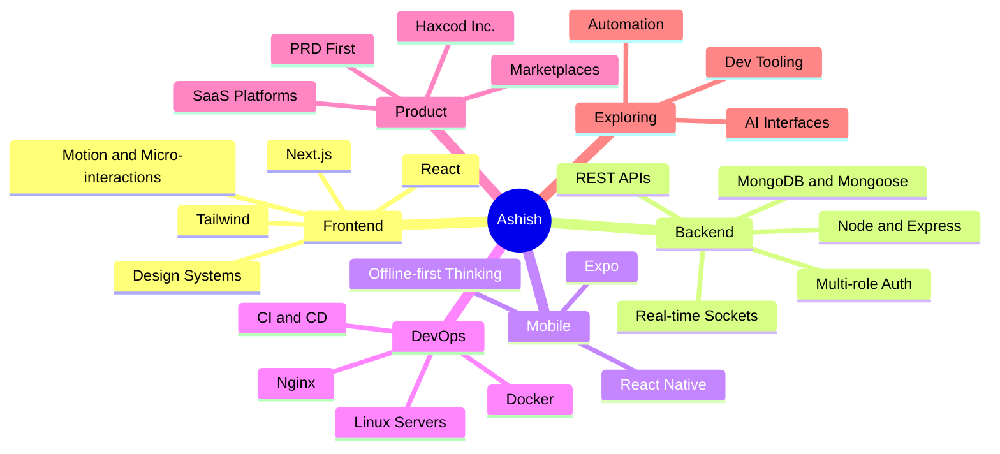
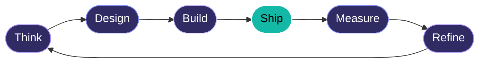
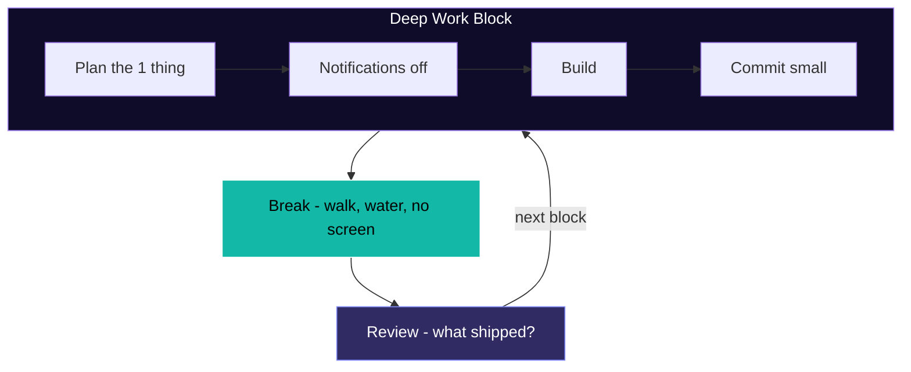
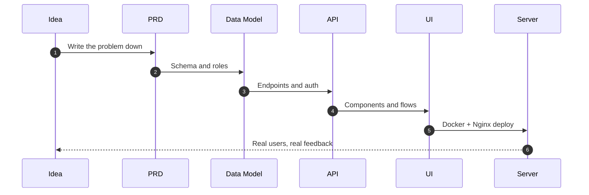
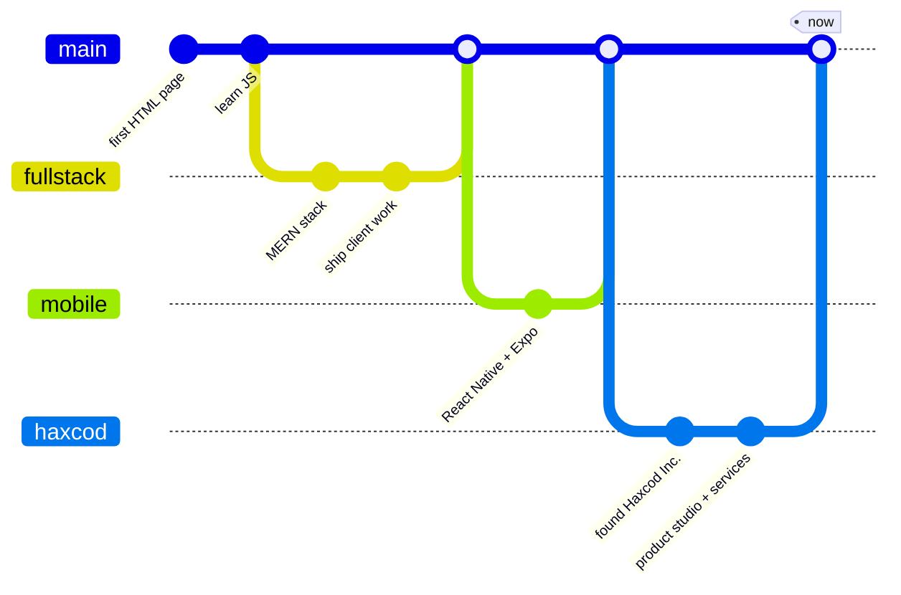

<div align="center">



<p>


</p>

<p>
<a href="https://mernfy.vercel.app/"></a>
<a href="https://linkedin.com/in/iamashishrathaur/"></a>
<a href="https://stackoverflow.com/users/23966934/"></a>
<a href="mailto:ashishrathour.dev@gmail.com"></a>
<a href="https://cal.com/haxcod/discovery"></a>
</p>

<p>
<a href="#whoami">whoami</a> &nbsp;·&nbsp;
<a href="#mindmap">mindmap</a> &nbsp;·&nbsp;
<a href="#focus">focus-cycle</a> &nbsp;·&nbsp;
<a href="#stack">stack</a> &nbsp;·&nbsp;
<a href="#work">work</a> &nbsp;·&nbsp;
<a href="#services">services</a> &nbsp;·&nbsp;
<a href="#stats">stats</a> &nbsp;·&nbsp;
<a href="#learning">learning</a> &nbsp;·&nbsp;
<a href="#connect">connect</a>
</p>

</div>

---

<a name="whoami"></a>
## `~/ whoami`

```ts
// profile.ts
const ashish = {
  role: "Full-stack & Mobile Engineer",
  founder: "Haxcod Inc.", // product studio + services
  owns: ["architecture", "backend", "frontend", "devops"],
  mindset: ["design-first", "DX-obsessed", "ship > perfect"],
  currently: {
    building: "Haxcod Inc. agency site + SaaS/marketplace products",
    exploring: ["AI-enhanced interfaces", "React Native + Expo"],
  },
  openTo: ["collabs", "freelance", "open-source", "mentoring"],
  funFact: "Opens the terminal before opening Figma.",
} as const;
```

---

<a name="mindmap"></a>
## `~/ mindmap`

> How my brain is wired: one engineer, five surfaces.


```mermaid
mindmap
  root((Ashish))
    Frontend
      React
      Next.js
      Tailwind
      Design Systems
      Motion and Micro-interactions
    Backend
      Node and Express
      MongoDB and Mongoose
      REST APIs
      Real-time Sockets
      Multi-role Auth
    Mobile
      React Native
      Expo
      Offline-first Thinking
    DevOps
      Docker
      Nginx
      CI and CD
      Linux Servers
    Product
      PRD First
      Marketplaces
      SaaS Platforms
      Haxcod Inc.
    Exploring
      AI Interfaces
      Automation
      Dev Tooling
```

---

<a name="focus"></a>
## `~/ focus-cycle`

> The loop I run on every product. No step is optional, no step is forever.


```mermaid
flowchart LR
    A([Think]) --> B([Design])
    B --> C([Build])
    C --> D([Ship])
    D --> E([Measure])
    E --> F([Refine])
    F --> A

    style A fill:#302b63,stroke:#A78BFA,color:#fff
    style B fill:#302b63,stroke:#818CF8,color:#fff
    style C fill:#302b63,stroke:#C4B5FD,color:#fff
    style D fill:#14B8A6,stroke:#fff,color:#000
    style E fill:#302b63,stroke:#818CF8,color:#fff
    style F fill:#302b63,stroke:#A78BFA,color:#fff
```


```mermaid
flowchart TD
    subgraph DEEP["Deep Work Block"]
        direction LR
        P1["Plan the 1 thing"] --> P2["Notifications off"] --> P3["Build"] --> P4["Commit small"]
    end
    DEEP --> BR["Break - walk, water, no screen"]
    BR --> RV["Review - what shipped?"]
    RV -->|"next block"| DEEP

    style DEEP fill:#0f0c29,stroke:#A78BFA,color:#fff
    style BR fill:#14B8A6,stroke:#fff,color:#000
    style RV fill:#302b63,stroke:#818CF8,color:#fff
```

---

<a name="stack"></a>
## `~/ stack`

<div align="center">


</div>

<table>
<tr>
<td width="25%" valign="top">

**Frontend**
- React, Next.js
- TypeScript
- Tailwind CSS
- Design systems

</td>
<td width="25%" valign="top">

**Backend**
- Node.js, Express
- MongoDB, Mongoose
- REST + real-time
- Auth and roles

</td>
<td width="25%" valign="top">

**Mobile**
- React Native
- Expo
- Shared logic with web

</td>
<td width="25%" valign="top">

**DevOps**
- Docker, Nginx
- Linux servers
- CI/CD pipelines
- Git workflows

</td>
</tr>
</table>

---

<a name="work"></a>
## `~/ featured-work`

| Project | What it is | Under the hood |
|---|---|---|
| **Cemzo** | Construction services marketplace with a real-time dashboard | Node API, real-time layer, self-managed infra |
| **VentureLauncher** · [venturelauncher.in](https://venturelauncher.in) | Startup / SaaS platform | Backend-heavy architecture, API-first |
| **DealSpark** | Affiliate marketing site | Structured data model, roadmap-driven |
| **Haxcod Inc.** | Agency website with its own design system | Theme-driven UI, PRD-first build |

<!-- Add repo links: [repo](https://github.com/haxcod/<name>) -->

### How a typical product ships


```mermaid
sequenceDiagram
    autonumber
    participant I as Idea
    participant P as PRD
    participant D as Data Model
    participant A as API
    participant U as UI
    participant S as Server
    I->>P: Write the problem down
    P->>D: Schema and roles
    D->>A: Endpoints and auth
    A->>U: Components and flows
    U->>S: Docker + Nginx deploy
    S-->>I: Real users, real feedback
```

---

<a name="services"></a>
## `~/ haxcod-inc`

<div align="center">

**Product studio + services. Same engineers, two ways to work with us.**

</div>

| Build with us | Details |
|---|---|
| Web apps and SaaS | Dashboards, marketplaces, multi-role platforms |
| Mobile apps | React Native + Expo, one codebase, two stores |
| Backend and APIs | Clean architecture, real-time, scalable schemas |
| DevOps | Dockerized deploys, Nginx, automated pipelines |
| Design systems | Tokens, components, themes that stay consistent |

<div align="center">
<a href="https://cal.com/haxcod/discovery"></a>
</div>

---

## `~/ principles`

```js
const rules = {
  "01": "Write the PRD before the first line of code.",
  "02": "Schema first. Bad data models outlive good UIs.",
  "03": "If it can be automated, it will be automated.",
  "04": "Design is not a layer. It is the product.",
  "05": "Small commits, fast deploys, honest metrics.",
  "06": "Boring tech, interesting product.",
};
```

---

## `~/ git-journey`


```mermaid
gitGraph
    commit id: "first HTML page"
    commit id: "learn JS"
    branch fullstack
    commit id: "MERN stack"
    commit id: "ship client work"
    checkout main
    merge fullstack
    branch mobile
    commit id: "React Native + Expo"
    checkout main
    merge mobile
    branch haxcod
    commit id: "found Haxcod Inc."
    commit id: "product studio + services"
    checkout main
    merge haxcod tag: "now"
```

---

<a name="stats"></a>
## `~/ stats`

<div align="center">


</div>

### Achievement shelf

```bash
$ ./unlock --list
```

<div align="center">


<br/>


</div>

---

<a name="learning"></a>
## `~/ currently-learning --2026`

```diff
+ AI-enhanced interfaces (UX that feels alive, not gimmicky)
+ React Native + Expo, production-grade mobile
+ Design systems that scale across web + mobile
+ Automation and dev tooling
- Over-engineering. (Deprecated.)
- "I'll refactor later." (Deprecated.)
```

---

<details>
<summary><b>$ cat now.md</b> (what I'm on this month)</summary>

<br/>

- [x] Multi-role user schema (MongoDB + TypeScript)
- [x] Real-time dashboards for a marketplace
- [ ] Haxcod Inc. agency site: PRD, design system, theme direction
- [ ] Ship, measure, refine. Repeat.

</details>

---

<a name="connect"></a>
## `~/ connect`

```bash
$ curl -X POST https://cal.com/haxcod/discovery \
    -d "topic=your idea" \
    -d "response=within 24h"

> 200 OK  -  let's build something.
```

<div align="center">

**Got a product idea, a messy codebase, or a design that needs engineering? Let's talk.**


</div>
